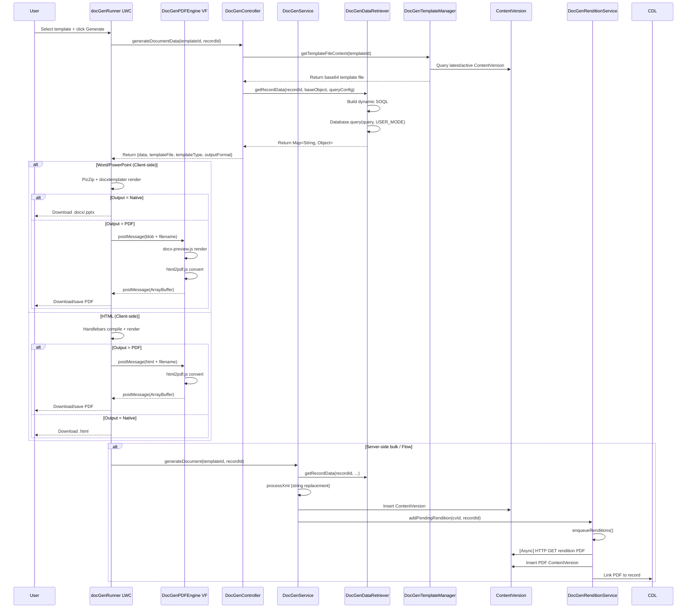
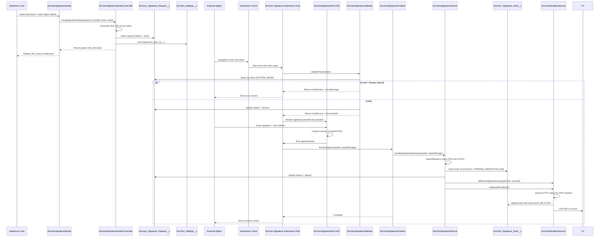
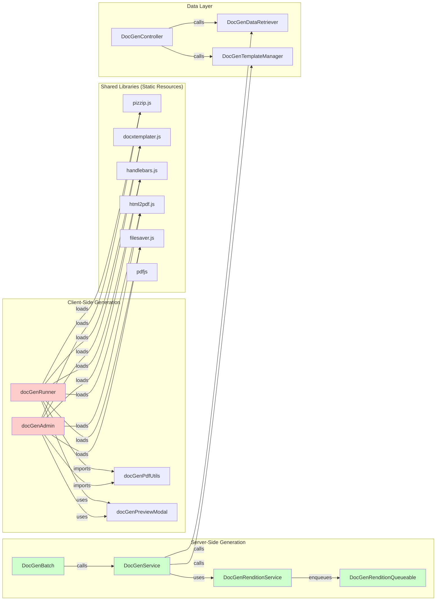
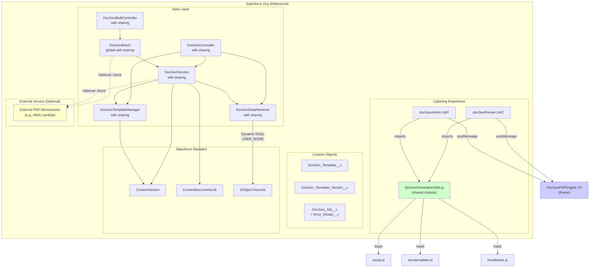

# DocGen Architecture Diagrams

**Date:** 2026-04-25

---

## 1. Current System Architecture

```mermaid
graph TB
    subgraph "Salesforce Org"
        subgraph "Lightning Experience"
            RUNNER["docGenRunner LWC<br/>(Record Page Action)"]
            ADMIN["docGenAdmin LWC<br/>(Template Manager)"]
            QB["docGenQueryBuilder LWC<br/>(Visual SOQL Builder)"]
            SIG_SEND["docGenSignatureSender LWC<br/>(Send for Signature)"]
            BULK["docGenBulkRunner LWC<br/>(Bulk Generation)"]
        end

        subgraph "Experience Cloud"
            FLOW["DocGen Signature Submission Flow"]
            SIG_PAD["docGenSignaturePad LWC<br/>(Canvas Signing)"]
        end

        subgraph "Apex Layer"
            CTRL["DocGenController<br/>with sharing"]
            SVC["DocGenService<br/>with sharing"]
            BATCH["DocGenBatch<br/>global with sharing"]
            REND_SVC["DocGenRenditionService<br/>with sharing"]
            SIG_SVC["DocGenSignatureService<br/>without sharing"]
            SIG_CTRL["DocGenSignatureController<br/>without sharing"]
            BULK_CTRL["DocGenBulkController<br/>with sharing"]
            DATA["DocGenDataRetriever<br/>with sharing"]
            TM["DocGenTemplateManager<br/>with sharing"]
        end

        subgraph "Async Processing"
            Q["DocGenRenditionQueueable<br/>implements Queueable"]
            EVT["DocGen_Rendition_Event__e<br/>Platform Event"]
            TRG["DocGenRenditionTrigger<br/>After Insert"]
        end

        subgraph "Custom Objects"
            TPL["DocGen_Template__c"]
            VER["DocGen_Template_Version__c"]
            JOB["DocGen_Job__c"]
            SIG_REQ["DocGen_Signature_Request__c"]
            AUDIT["DocGen_Signature_Audit__c"]
            SETTINGS["DocGen_Settings__c"]
        end

        subgraph "Salesforce Standard"
            CV["ContentVersion"]
            CDL["ContentDocumentLink"]
            SOBJ["SObject Records"]
        end

        subgraph "External / Callout"
            NC["Named Credential<br/>DocGen_Loopback"]
            AP["Auth Provider<br/>(hardcoded consumer key)"]
        end
    end

    RUNNER -->|generateDocumentData| CTRL
    ADMIN -->|getAllTemplates/saveTemplate| CTRL
    BULK -->|submitJob| BULK_CTRL
    SIG_SEND -->|createSignatureRequest| SIG_CTRL

    CTRL --> SVC
    CTRL --> DATA
    CTRL --> TM
    BULK_CTRL --> BATCH
    BATCH --> SVC
    SVC --> DATA
    SVC --> TM
    SVC --> REND_SVC

    REND_SVC -->|addPendingRendition| EVT
    EVT --> TRG
    TRG --> Q
    Q -->|HTTP GET /connect/files/{id}/rendition| NC
    NC -->|OAuth| AP

    SIG_CTRL --> SIG_SVC
    FLOW --> SIG_PAD
    SIG_PAD -->|Flow Action| SIG_SVC

    DATA -->|Dynamic SOQL| SOBJ
    TM -->|Query| CV
    SVC -->|Insert| CV
    SVC -->|Insert| CDL
    SIG_SVC -->|Insert| CV
    SIG_SVC -->|Insert| AUDIT
    SIG_SVC -->|Update| SIG_REQ

    CTRL -->|CRUD| TPL
    CTRL -->|CRUD| VER
    BULK_CTRL -->|CRUD| JOB
    SIG_CTRL -->|CRUD| SIG_REQ

    RUNNER -.->|postMessage| VF["DocGenPDFEngine<br/>Visualforce Page"]
    ADMIN -.->|postMessage| VF
```

---

## 2. Data Flow: Single Record Document Generation



---

## 3. Data Flow: E-Signature Experience Cloud



---

## 4. Component Dependency Diagram



**Red nodes** indicate components with duplicated code.
**Green nodes** indicate server-side components.

---

## 5. Refactored Architecture (Post-Recommendations)



**Key Changes:**
1. Shared `docGenGenerationUtils.js` eliminates duplication
2. Loopback callout removed from standard path
3. External PDF microservice shown as optional future path for bulk
4. `Error_Details__c` field added to `DocGen_Job__c`
